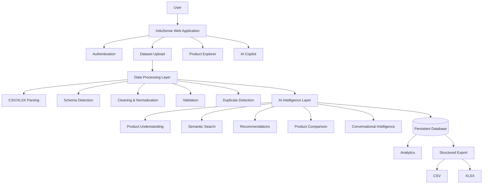
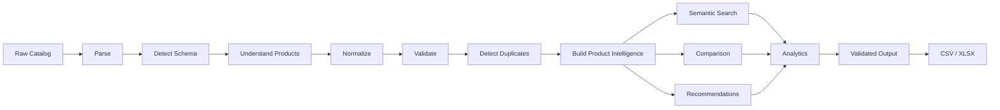

# 🚀 InduSense AI

## AI-Powered Industrial Product Intelligence Platform

<p align="center">
  
</p>

<h3 align="center">
  Turn Industrial Data Into Intelligence.
</h3>

<p align="center">
  Transform fragmented industrial product catalogs into structured,
  searchable, explainable and actionable product intelligence.
</p>

<p align="center">
  <a href="https://indusenseai-iiy8g3odh-nehal390s-projects.vercel.app/">
    
  </a>
</p>

---

# 🧠 What is InduSense AI?

**InduSense AI** is an AI-powered Industrial Product Intelligence platform that transforms raw and fragmented industrial product catalogs into an intelligent, searchable and decision-ready product system.

Industrial companies often manage thousands of products through CSV/XLSX files containing:

* inconsistent product names
* missing specifications
* duplicate records
* inconsistent technical attributes
* poorly structured descriptions
* incomplete product information
* difficult-to-search data

InduSense AI adds an **intelligence layer** over this catalog.

Instead of treating the catalog as a spreadsheet, the platform helps businesses:

**Understand → Clean → Connect → Search → Compare → Recommend → Decide**

---

# 🎯 The Problem

A traditional industrial product catalog mainly stores information.

But businesses need to **understand that information**.

For example, a catalog may contain:

```text
Siemens 5HP Motor
Siemens Motor 5 Horsepower
5 HP Siemens Industrial Motor
SIEMENS MOTOR 5 HP
```

A conventional keyword search can treat these as separate records.

InduSense AI can identify semantic relationships between such records and help users determine whether they represent similar or potentially duplicate products.

At the same time, users may need answers such as:

> Which bearing is suitable for high-speed machinery?

> Which products are duplicates?

> Which products have incomplete specifications?

> Which alternative product is closest to my requirement?

> Why was this product recommended?

InduSense AI turns these questions into an intelligent product-data workflow.

---

# 💡 The Solution

```text
RAW CSV / XLSX
      ↓
DATA PARSING
      ↓
SCHEMA & FIELD DETECTION
      ↓
AI PRODUCT UNDERSTANDING
      ↓
CLEANING & NORMALIZATION
      ↓
DUPLICATE / SIMILARITY DETECTION
      ↓
PRODUCT INTELLIGENCE
      ↓
SEMANTIC SEARCH
      ↓
COMPARISON & RECOMMENDATIONS
      ↓
DATA QUALITY ANALYTICS
      ↓
STRUCTURED XLSX / CSV EXPORT
```

---

# ⭐ What Makes InduSense Different?

Most industrial commerce systems primarily focus on:

**finding, listing or selling products.**

InduSense AI focuses on the **intelligence layer behind the product catalog**.

It helps answer:

* What products do we actually have?
* Which records are duplicates?
* Which information is missing?
* Which products are related?
* Which product matches my requirements?
* What are the best alternatives?
* Why is this product recommended?

## Core USP

> **Product Catalog → Product Intelligence**

---

# ⚡ Product Experience

<p align="center">
  
</p>

The platform transforms:

```text
FRAGMENTED DATA
      ↓
AI UNDERSTANDING
      ↓
STRUCTURED DATA
      ↓
PRODUCT RELATIONSHIPS
      ↓
PRODUCT INTELLIGENCE
      ↓
BETTER DECISIONS
```

---

# ✨ Core Features

## 📁 Intelligent CSV/XLSX Ingestion

Upload real industrial product catalogs in:

* CSV
* XLSX

The platform dynamically identifies:

* rows
* columns
* field types
* product attributes
* missing information
* potential inconsistencies

---

## 🤖 AI Product Understanding

Analyze and interpret information such as:

* product name
* description
* category
* manufacturer
* supplier
* specifications
* applications
* technical attributes
* pricing
* availability

The system distinguishes source information from AI-derived intelligence where applicable.

---

## 🧹 Data Cleaning & Normalization

Identify issues such as:

* inconsistent naming
* inconsistent capitalization
* missing attributes
* malformed values
* incomplete descriptions
* category inconsistencies
* inconsistent technical information

---

## 🔄 Semantic Duplicate Detection

Identify products that may represent the same or closely related item even when their names differ.

Example:

```text
Siemens 5HP Motor
        ↓
Siemens Motor 5 Horsepower
        ↓
5 HP Siemens Industrial Motor
```

Potential duplicate groups can include:

* similarity score
* matched fields
* confidence
* explanation

---

## 🔍 Natural-Language Product Search

Users can search the catalog using natural language.

Examples:

```text
Find bearings suitable for high-speed industrial machinery.

Show alternatives to this motor.

Find pumps suitable for high-pressure applications.

Which products have incomplete specifications?

Find products similar to this one.
```

---

## 🧠 Product Intelligence Profiles

Each product can be represented using an intelligent profile containing relevant information such as:

* product identity
* category
* manufacturer
* specifications
* applications
* supplier
* price
* data completeness
* AI confidence
* similar products
* alternatives
* potential duplicates

---

## 💡 Explainable AI Recommendations

Example:

```text
User:
Find a bearing suitable for high-speed machinery.

              ↓

BEST MATCH
SKF 6205-2RS1

Match Score: 94%

Why:
✓ Suitable application
✓ Relevant technical attributes
✓ Strong data completeness
✓ Suitable alternatives available
```

Recommendations should include reasoning rather than only a score.

---

## ⚖️ Product Comparison

Compare multiple products using:

* technical specifications
* price
* manufacturer
* application
* compatibility
* completeness
* relevant attributes

The AI layer can summarize:

**Best option → Why → Trade-offs → Alternatives**

---

## 📊 Data Quality Intelligence

Measure:

* completeness
* consistency
* validity
* duplicate risk
* attribute coverage
* missing fields

Example:

```text
Overall Data Quality     89%

Completeness             92%
Consistency              87%
Validity                 91%
Duplicate Risk           23%
```

---

## 📈 Catalog Analytics

Analyze:

* total products
* categories
* manufacturers
* suppliers
* duplicate groups
* missing information
* attribute coverage
* quality indicators

---

## 🤝 InduSense Copilot

An AI assistant for interacting with the active product catalog.

Example questions:

```text
Summarize this catalog.

Find duplicate products.

Which category has the most missing information?

Compare these products.

Why was this product recommended?

Which products should be reviewed first?
```

---

## 🎙️ Voice Assistant

Voice interaction can follow:

```text
Voice Input
    ↓
Speech-to-Text
    ↓
AI Understanding
    ↓
Catalog Search / Analysis
    ↓
AI Response
    ↓
Text-to-Speech
```

The interface provides animated listening, processing and response states.

---

## 📤 Structured Export

Generate:

* CSV
* XLSX

The output pipeline validates the generated structure before allowing download.

---

# 🎬 Feature Demonstrations

## 🔍 AI Search

<p align="center">
  
</p>

Natural-language queries are translated into relevant product discovery.

---

## 🔄 Duplicate Detection

<p align="center">
  
</p>

Semantically similar product records can be grouped and reviewed.

---

## ⚖️ Product Comparison

<p align="center">
  
</p>

Compare technical attributes and receive explainable AI insights.

---

## 🤖 AI Copilot

<p align="center">
  
</p>

Interact conversationally with the active catalog.

---

## 📊 Analytics & Data Quality

<p align="center">
  
</p>

Understand the overall health and structure of the product catalog.

---

# 🏗️ System Architecture



---

# 🔄 End-to-End Processing Pipeline



---

# 🧠 AI Architecture

```text
Product Record
      ↓
Field Interpretation
      ↓
Product Understanding
      ↓
Attribute Extraction
      ↓
Category / Application Understanding
      ↓
Similarity Analysis
      ↓
Recommendation Reasoning
      ↓
Natural-Language Response
```

AI is primarily used for semantic and contextual tasks.

Deterministic operations such as:

* parsing
* validation
* counting
* formatting
* calculations
* output generation

should remain programmatic wherever appropriate.

---

# 🛠️ Technology Stack

## Frontend

| Technology                       | Purpose                                                |
| -------------------------------- | ------------------------------------------------------ |
| **Next.js**                      | Application framework, routing and server capabilities |
| **React**                        | Component-based UI architecture                        |
| **TypeScript**                   | Type safety and maintainability                        |
| **Tailwind CSS**                 | Responsive interface styling                           |
| **Framer Motion**                | UI animation and micro-interactions                    |
| **GSAP / ScrollTrigger**         | Advanced scroll-based storytelling                     |
| **Three.js / React Three Fiber** | 3D visualization                                       |
| **HTML5 Canvas**                 | Image-sequence rendering                               |
| **Recharts**                     | Analytics visualization                                |

## AI & Intelligence

| Technology                  | Purpose                                      |
| --------------------------- | -------------------------------------------- |
| **Google Gemini**           | Product understanding and AI reasoning       |
| **Semantic Retrieval**      | Natural-language catalog search              |
| **Similarity Analysis**     | Product relationship and duplicate detection |
| **AI Recommendation Logic** | Product ranking and explanation              |

## Data Processing

| Technology           | Purpose                              |
| -------------------- | ------------------------------------ |
| **XLSX**             | Spreadsheet ingestion and generation |
| **CSV Processing**   | Catalog ingestion and export         |
| **Schema Detection** | Dynamic dataset understanding        |
| **Validation Layer** | Data and output verification         |

## Backend & Persistence

| Technology                   | Purpose                                  |
| ---------------------------- | ---------------------------------------- |
| **Next.js Server/API Layer** | Application APIs and server-side logic   |
| **Database**                 | Persistent user/catalog/application data |
| **Authentication**           | User identity and access management      |

## Deployment

| Technology                | Purpose               |
| ------------------------- | --------------------- |
| **Vercel**                | Production deployment |
| **Environment Variables** | Secure configuration  |

> **Important:** keep this section synchronized with the actual dependencies and services present in the repository.

---

# 🔐 Security

InduSense AI follows standard secure-development practices:

* environment-based secret management
* server-side API credentials
* input validation
* file-type validation
* authentication and authorization
* controlled API access
* separation of client/server responsibilities
* no secrets committed to source control

---

# ⚡ Performance

The platform uses performance-conscious techniques for data-heavy and animation-heavy experiences:

* lazy loading
* dynamic imports
* optimized images
* optimized video assets
* frame preloading
* Canvas rendering
* GPU-accelerated animations
* responsive rendering
* efficient API processing

---

# 📱 Responsive Experience

InduSense AI is designed for:

* Desktop
* Laptop
* Tablet
* Mobile

Complex visual effects can be reduced on lower-powered devices while keeping the core product functionality intact.

---

# 📂 Project Structure

```text
indusense-ai/
│
├── app/
│   ├── api/
│   ├── dashboard/
│   ├── products/
│   ├── search/
│   ├── compare/
│   ├── analytics/
│   └── settings/
│
├── components/
│   ├── ui/
│   ├── product/
│   ├── analytics/
│   ├── copilot/
│   └── animations/
│
├── lib/
│   ├── ai/
│   ├── data/
│   ├── database/
│   ├── validation/
│   └── utilities/
│
├── public/
│   ├── images/
│   ├── videos/
│   └── frames/
│
├── types/
│
├── .env.example
├── package.json
└── README.md
```

---

# ⚙️ Installation

## Prerequisites

* Node.js
* npm / pnpm
* AI API configuration if enabled
* Database configuration if persistence is enabled

## Clone

```bash
git clone https://github.com/YOUR_USERNAME/indusense-ai.git
cd indusense-ai
```

## Install dependencies

```bash
npm install
```

or:

```bash
pnpm install
```

## Environment Variables

Create:

```text
.env.local
```

Example:

```env
GEMINI_API_KEY=your_api_key
DATABASE_URL=your_database_url
```

Add other project-specific variables required by the deployment.

## Start locally

```bash
npm run dev
```

Open:

```text
http://localhost:3000
```

---

# 🌐 Live Demo

## InduSense AI

https://indusenseai-iiy8g3odh-nehal390s-projects.vercel.app/

---

# 🧪 Demo Workflow

```text
OPEN INDUSENSE AI
       ↓
UPLOAD INDUSTRIAL CATALOG
       ↓
AI PROCESSING
       ↓
PRODUCT INTELLIGENCE
       ↓
NATURAL-LANGUAGE SEARCH
       ↓
DUPLICATE DETECTION
       ↓
PRODUCT COMPARISON
       ↓
AI RECOMMENDATION
       ↓
DATA QUALITY
       ↓
AI COPILOT
       ↓
ANALYTICS
       ↓
XLSX / CSV EXPORT
```

---

# 📊 Demo Dataset

A demo industrial catalog can be used to demonstrate:

* product understanding
* duplicate detection
* missing-field detection
* semantic search
* product recommendation
* comparison
* quality analytics
* structured export

Suggested product categories include:

* Bearings
* Motors
* Pumps
* Sensors
* Valves
* Drives
* Gearboxes
* Compressors
* Filters
* Automation Components
* Actuators

---

# 🏢 Target Users

InduSense AI is designed for:

* Industrial manufacturers
* B2B marketplaces
* Procurement teams
* Catalog managers
* Product information management teams
* Industrial distributors
* Suppliers
* Technical sales teams
* Operations teams

---

# 💼 Business Benefits

### ⏱ Reduced Manual Work

Automates repetitive catalog-analysis tasks.

### 📊 Improved Data Quality

Helps identify missing, inconsistent and duplicate information.

### 🔍 Faster Product Discovery

Natural-language search simplifies discovery across large catalogs.

### 🧠 Better Product Decisions

Explainable comparisons and recommendations support faster decisions.

### 📈 Scalable Catalog Management

The architecture can be extended to large and continuously changing product catalogs.

---

# 🚀 Future Roadmap

## Phase 1 — Catalog Intelligence

* CSV/XLSX ingestion
* AI product understanding
* normalization
* duplicate detection
* semantic search
* recommendation
* export

## Phase 2 — Enterprise Intelligence

* technical PDF ingestion
* manufacturer datasheet extraction
* supplier intelligence
* vector search
* ERP/PIM integration

## Phase 3 — Continuous Intelligence

* automatic catalog synchronization
* real-time updates
* multilingual intelligence
* predictive analytics
* intelligent change detection
* supplier monitoring

---

# 🧩 Potential Enterprise Integrations

Future integrations may include:

* ERP systems
* PIM platforms
* supplier catalogs
* procurement platforms
* inventory systems
* manufacturer databases
* document management systems

---

# 📌 Project Vision

> **Don't just store industrial product data. Understand it.**

InduSense AI transforms a traditional product catalog into an intelligent system that can **understand, connect, search, compare and reason about industrial products.**

---

# 🔗 Project Links

### 🌐 Live Prototype

https://indusenseai-iiy8g3odh-nehal390s-projects.vercel.app/

### 💻 GitHub Repository

Add your GitHub repository URL here.

### 🎥 Demo Video

Add your final demo video URL here.

---

# 👥 Team

**Project:** InduSense AI

**Category:** AI / Industrial Product Intelligence

### Team Members

Add team member names and responsibilities here.

---

# 📄 License

Add your selected project license here.

---

<p align="center">

### InduSense AI

**Turn Industrial Data Into Intelligence.**

</p>
